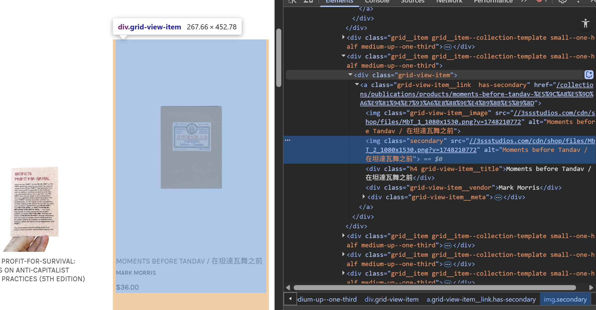
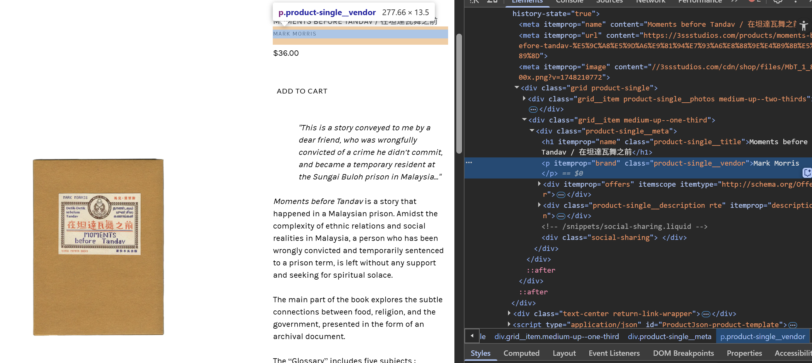
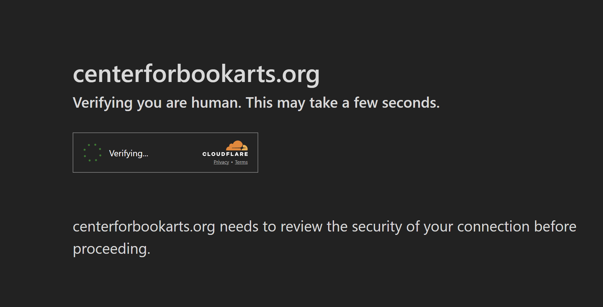
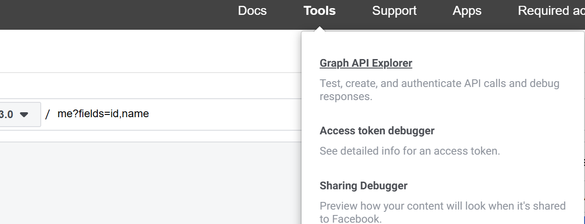
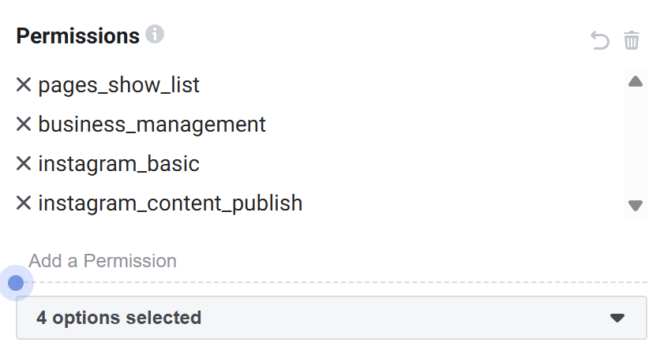
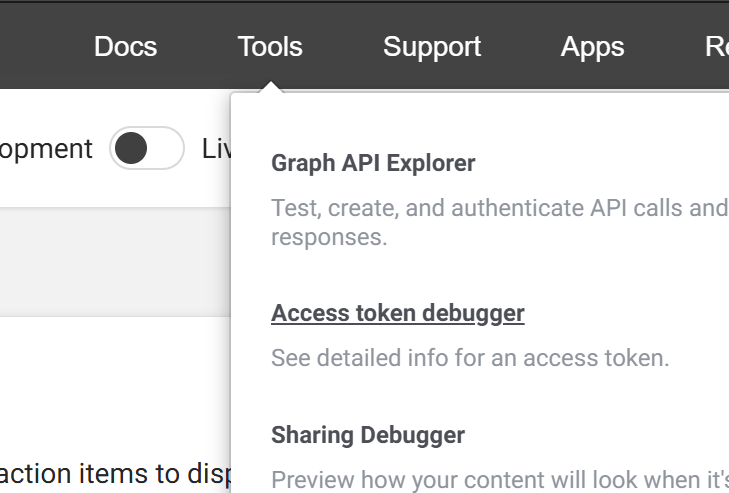
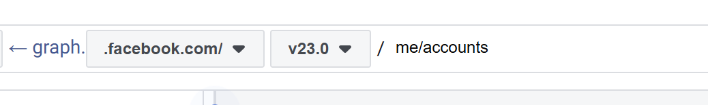
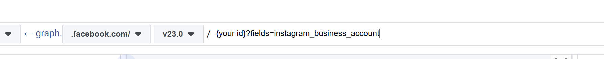
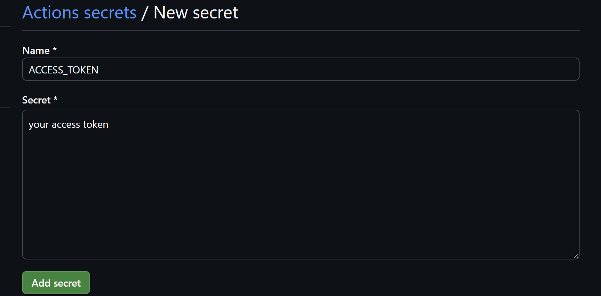

# Alison built a Magic Instagram Bot 


## Intro  

I found that the newly released independently published books, zines, and artists' books aren’t really compiled anywhere. You can maybe hear about the more popular ones through big art book fairs or by following a few wellknown indie bookstores like Printed Matter, and looking at their curated lists. But I think we could all benefit from a little Instagram bot that automatically posts about niche new books.

Written in a storybook style, this tutorial documents my process in creating this workflow.
1. Scraped book listings from Shopify-based and static HTML indie bookstore sites  
2. Built an Instagram bot using the official Instagram Graph API to post the cover, title, and description of new books from stores like Center for Book Arts, and Bungee Space  
3. Set up a workflow to keep the list of books updated 

---

## Part One: Retrieving book titles in Telekinesis

### 1.1 Wielding the Magic Sword of BS4 (example: 3ssstudios.com) 

#### Set Up
In this part: I used Python with the following libraries:
- `pandas`
- `beautifulsoup4`
- `requests`

Set up Python by following the Programming Historian guide if you need it.

#### The Page
We’ll use this URL from Bungee Space (hosted on Shopify):  
`https://3ssstudios.com/collections/publications`

This is the product index page that shows thumbnails and basic info for all the books. But we want to get more detailed data, so we need to extract the links to each product’s detail page.

To get the link, I needed to find the element for it in html:



These links look like this:  
`https://3ssstudios.com/collections/publications/products/the-words-of-a-gentleman-1`


Here’s the scraping code to grab the product detail page URLs and associated title + image:

```python
import requests
from bs4 import BeautifulSoup
import pandas as pd

url = "https://3ssstudios.com/collections/publications"
headers = {"User-Agent": "Mozilla/5.0"}
response = requests.get(url, headers=headers)
soup = BeautifulSoup(response.content, "html.parser")

catalog_container = soup.find("div", class_="grid grid--uniform grid--view-items")
items = []

for item in catalog_container.find_all("div", class_="grid-view-item"):
    img_tag = item.find("img", class_="grid-view-item__image")
    image_link = img_tag['src'] if img_tag and 'src' in img_tag.attrs else None

    title_tag = item.find("div", class_="h4 grid-view-item__title")
    title = title_tag.get_text(strip=True) if title_tag else None

    a_tag = item.find("a", href=True)
    url = f"https://3ssstudios.com{a_tag['href']}" if a_tag else None

    items.append({"title": title, "image link": image_link, "url": url})

df = pd.DataFrame(items)
```
### 1.2 Cracking the Code of Pagination for Shopify

So far, this only gets the first page.

But Shopify uses cursor-based pagination. That long jumble of characters you’ll see in the URL after ?page=2&phcursor=... is a Page Handle Cursor (or phcursor). It’s a base64-encoded token that tells Shopify what to load next. You can’t just increment the page number — you need to dynamically extract the href from the “Next” pagination button on the page.

I wrote a function for that:

```python
def find_next_url(soup):
    pagination_links = soup.select("a.btn.btn--secondary.btn--narrow")
    for link in pagination_links:
        if ">" in link.get_text() or "Next" in link.get_text():
            return "https://3ssstudios.com" + link['href']
    return None

```
And then I wrapped it all in a loop:

```python
import time

BASE_URL = "https://3ssstudios.com"
START_URL = f"{BASE_URL}/collections/publications"
HEADERS = {"User-Agent": "Mozilla/5.0"}

all_items = []

def scrape_page(url):
    response = requests.get(url, headers=HEADERS)
    soup = BeautifulSoup(response.content, "html.parser")
    catalog_container = soup.find("div", class_="grid grid--uniform grid--view-items")
    if not catalog_container:
        return [], None

    items = []
    for item in catalog_container.find_all("div", class_="grid-view-item"):
        img_tag = item.find("img", class_="grid-view-item__image")
        image_link = img_tag['src'] if img_tag and 'src' in img_tag.attrs else None

        title_tag = item.find("div", class_="h4 grid-view-item__title")
        title = title_tag.get_text(strip=True) if title_tag else None

        a_tag = item.find("a", href=True)
        item_url = f"{BASE_URL}{a_tag['href']}" if a_tag else None

        items.append({
            "title": title,
            "image link": image_link,
            "url": item_url
        })

    next_page = find_next_url(soup)
    return items, next_page

next_page = START_URL

while next_page:
    print(f"Scraping: {next_page}")
    items, next_page = scrape_page(next_page)
    all_items.extend(items)
    time.sleep(1)  

df = pd.DataFrame(all_items)
```
### 1.3 Get Detailed Information
Now that we have a list of URLs, let’s visit each one and extract more info：

I only needed the brand (publisher/imprint) and a short description, so I wrote a simple detail page scraper:

```python
def scrape_detail_page(url):
    try:
        res = requests.get(url, headers=HEADERS)
        soup = BeautifulSoup(res.content, "html.parser")

        brand_tag = soup.find("p", itemprop="brand")
        brand = brand_tag.get_text(strip=True) if brand_tag else None

        desc_tag = soup.find("div", itemprop="description")
        description = desc_tag.get_text(strip=True) if desc_tag else None

        return brand, description
    except Exception: 
        print(f"Error scraping detail page {url}: {e}")
        return None, None
```

### The complete code
```python
import requests
from bs4 import BeautifulSoup
import pandas as pd
import time

BASE_URL = "https://3ssstudios.com"
START_URL = f"{BASE_URL}/collections/publications"
HEADERS = {
    "User-Agent": "Mozilla/5.0"
}

all_items = []

def scrape_detail_page(url):
    try:
        res = requests.get(url, headers=HEADERS)
        soup = BeautifulSoup(res.content, "html.parser")

        # Extract brand
        brand_tag = soup.find("p", itemprop="brand")
        brand = brand_tag.get_text(strip=True) if brand_tag else None

        # Extract description
        desc_tag = soup.find("div", itemprop="description")
        description = desc_tag.get_text(strip=True) if desc_tag else None

        return brand, description
    except Exception as e:
        print(f"Error scraping detail page {url}: {e}")
        return None, None

def scrape_page(url):
    response = requests.get(url, headers=HEADERS)
    soup = BeautifulSoup(response.content, "html.parser")

    catalog_container = soup.find("div", class_="grid grid--uniform grid--view-items")
    if not catalog_container:
        return [], None

    items = []

    for item in catalog_container.find_all("div", class_="grid-view-item"):
        img_tag = item.find("img", class_="grid-view-item__image")
        image_link = img_tag['src'] if img_tag and 'src' in img_tag.attrs else None

        title_tag = item.find("div", class_="h4 grid-view-item__title")
        title = title_tag.get_text(strip=True) if title_tag else None

        a_tag = item.find("a", href=True)
        item_url = f"{BASE_URL}{a_tag['href']}" if a_tag else None

       
        brand, description = scrape_detail_page(item_url) if item_url else (None, None)

        items.append({
            "title": title,
            "image link": image_link,
            "url": item_url,
            "brand": brand,
            "description": description
        })

        time.sleep(0.5)  

    next_page = find_next_url(soup)
    return items, next_page

def find_next_url(soup):
    pagination_links = soup.select("a.btn.btn--secondary.btn--narrow")
    for link in pagination_links:
        if ">" in link.get_text() or "Next" in link.get_text():
            return BASE_URL + link['href']
    return None

next_page = START_URL
while next_page:
    print(f"Scraping: {next_page}")
    items, next_page = scrape_page(next_page)
    all_items.extend(items)
    time.sleep(1)

dfBungee = pd.DataFrame(all_items)

```

### 1.4 Sneak Past the Bot Verification Guard in the Selenium Trojan Horse

example site: centerforbookarts.org
When trying to scrape this site with BS4, I ran into a verification block for my request. This can happen sometimes if too many people (or just you) angered the gods guarding the website and they decide to use a cloudfare blocker to stop shameless web scraping.


I decided to use Selenium, a Python library that allows the code to open a web browser and simulate real interactions (like clicking, typing, etc.) and specific delays to test whether it was a bot detection issue. The site still returned no results. Below is a brief tutorial using Selenium to try to scrape the site's info.

```python
from selenium import webdriver
from selenium.webdriver.chrome.service import Service
from selenium.webdriver.chrome.options import Options


chrome_options = Options()
chrome_options.add_argument("--headless")
chrome_options.add_argument("--disable-gpu")


service = Service()
driver = webdriver.Chrome(service=service, options=chrome_options)

all_books = []


for page in range(1, 6):  
    url = f"https://centerforbookarts.org/book-shop?cats=artists-books&pg={page}"
    print(f"Scraping: {url}")
    
    driver.get(url)
    time.sleep(2)  

    soup = BeautifulSoup(driver.page_source, "html.parser")
    posts = soup.find_all('div', class_='post-content')

    for post in posts:
        category_div = post.find('div', class_='post-header')
        category = category_div.get_text(strip=True) if category_div else None

        title_tag = post.find('h2', class_='post-title')
        title = title_tag.get_text(strip=True) if title_tag else None

        image_div = post.find('div', class_='post-image')
        img_tag = image_div.find('img', decoding='async') if image_div else None
        image_link = img_tag['src'] if img_tag else None

        a_tag = post.find('a') if post else None
        book_url = a_tag['href'] if a_tag and 'href' in a_tag.attrs else None
        book_url = book_url if book_url.startswith('http') else f"https://centerforbookarts.org{book_url}"

 
        brand = None
        description = None


        if book_url:
            try:
                driver.get(book_url)
                time.sleep(1.5)  

                detail_soup = BeautifulSoup(driver.page_source, "html.parser")

                brand_tag = detail_soup.find('h2', class_='hero-subtitle')
                brand = brand_tag.get_text(strip=True) if brand_tag else None

                col_div = detail_soup.find('div', class_='col')
                if col_div:
                    p_tag = col_div.find('p')
                    description = p_tag.get_text(strip=True) if p_tag else None

            except Exception as e:
                print(f"Error scraping detail page {book_url}: {e}")

        all_books.append({
            'title': title,
            'image link': image_link,
            'url': item_url,
            'brand': brand,
            'description': description
        })

driver.quit()

dfCBA = pd.DataFrame(all_books)
```
## Part Two: Compile the Lose Treasures into a Self-Updating Magic Sheet

### 2.1 Compile the two Data Frames

```python

df_combined = pd.concat([dfCBA, dfBungee], ignore_index=True)
df_combined.to_csv("output.csv", index=False)
```

### 2.2 Set Up Updating Spell with Github

- First, put your scraping codes into one file called 'scrapers.py'; 
- Set up a requirements.txt file and append the following: 
```txt
beautifulsoup4
selenium
pandas
webdriver-manager
requests
python-dotenv
```
- Create a scraper.yml file and append the following:

```yml
name: Run scraper.py

on:
  workflow_dispatch:  

permissions:
  contents: write  

jobs:
  run-scraper:
    runs-on: ubuntu-latest

    steps:
    - name: Checkout repo
      uses: actions/checkout@v3

    - name: Set up Python
      uses: actions/setup-python@v4
      with:
        python-version: '3.10'

    - name: Install Chrome and ChromeDriver
      run: |
        sudo apt-get update
        sudo apt-get install -y wget unzip
        wget https://dl.google.com/linux/direct/google-chrome-stable_current_amd64.deb
        sudo dpkg -i google-chrome-stable_current_amd64.deb || sudo apt-get -fy install
        CHROME_VERSION=$(google-chrome --version | grep -oP "\d+\.\d+\.\d+\.\d+")
        wget -N https://edgedl.me.gvt1.com/edgedl/chrome/chrome-for-testing/$CHROME_VERSION/linux64/chromedriver-linux64.zip
        unzip chromedriver-linux64.zip
        sudo mv chromedriver-linux64/chromedriver /usr/local/bin/chromedriver
        sudo chmod +x /usr/local/bin/chromedriver

    - name: Install dependencies
      run: |
        python -m pip install --upgrade pip
        pip install -r requirements.txt

    - name: Run scraper
      run: python ./scraper.py

    - name: Commit output.csv to the repo
      run: |
        git config --global user.name "github-actions[bot]"
        git config --global user.email "github-actions[bot]@users.noreply.github.com"
        git add output.csv
        git commit -m "Update output.csv from scraper run" || echo "No changes to commit"
        git push

    - name: Upload CSV artifact
      uses: actions/upload-artifact@v4
      with:
        name: scraped-data
        path: ./output.csv


```

Now, initiate a repository and commit your changes.

Then, you can go to your GitHub repo, 

-->click on 'Actions'--> 'Run Scraper'--> Run workflow

then it will appear as a file in your repo.

## Part Three: Re-arrange Your Internal Organs to Become an Instagram Graph API Authorized User

### 3.1 Requirements
- make a new Facebook account and use it to sign up for a Facebook Developer Account at 'https://developers.facebook.com/'

- Create a Facebook Page for your Account

❗Make a new Instagram account and set it to ❗Business or Creator, ❗Link it to the Facebook account.

### 3.2 Create an App

Go to 'https://developers.facebook.com/'

-->Create App -->select type as Business --> set up name, contact, urls

-->Add Products-->Instagram Graph API.


### 3.3 Get an Access Token

Next, get an access token to authenticate your API calls:

- User Token: Use Tools-->Graph API Explorer, 

select your app, and select instagram_basic, pages_show_list,...Permissions from the bottom right(as shown below). 


- Then, Generate a access token. Exchange this user token for a longer-lived Token, otherwise it expires in two hours.
- Go to Tools-->Access Token Debugger-->Access Token-->enter the access token you just generated-->Debug


OR
Use this code:
```
GET https://graph.facebook.com/v15.0/oauth/access_token?
  grant_type=fb_exchange_token
  &client_id={app-id}
  &client_secret={app-secret}
  &fb_exchange_token={short-lived-token}
```

### 3.4 Get the instagram business account id:

In the left-top side of Graph API explorer, request for params ```me/accounts```

click on the id number for your Facebook page.
then after your id, requet for params ```?fields=instagram_business_account```

copy the id for your instagram business account from the window below.

## Part Four: Set Up the Instagram Bot 

### 2.1 Create a Script for Your Bot

create a file named ```bot.py``` and paste in the script.

- essentially, in three steps, the script reads the data, append it to a media container and send it to the api to create it, then it sends another request to publish it to your account

```python
import pandas as pd
import requests
import os
import random

from dotenv import load_dotenv

load_dotenv()
ACCESS_TOKEN = os.getenv("ACCESS_TOKEN")
IG_USER_ID = os.getenv("IG_USER_ID")

df = pd.read_csv("ouput.csv")
random_index = random.randint(0, len(df) - 1)
title = df[random_index, 'title']
image_url = df['image link']

#create a media container
create_url = f'https://graph.facebook.com/v19.0/{IG_USER_ID}/media'
create_payload = {
    'image_url': 'https:'+ image_url,
    'caption': title + '--Alison has built a bot that posts books to Instagram! This is a test post done with the Insta api and Python, weeeeee!',
    'access_token': ACCESS_TOKEN
}
create_res = requests.post(create_url, data=create_payload)
create_res_json = create_res.json()

if 'id' not in create_res_json:
    raise Exception(f"Error creating media container: {create_res_json}")

creation_id = create_res_json['id']
print("Media container created:", creation_id)


# publish the media container
publish_url = f'https://graph.facebook.com/v19.0/{IG_USER_ID}/media_publish'
publish_payload = {
    'creation_id': creation_id,
    'access_token': ACCESS_TOKEN
}
publish_res = requests.post(publish_url, data=publish_payload)
publish_res_json = publish_res.json()


if 'id' not in publish_res_json:
    raise Exception(f"Error publishing media: {publish_res_json}")

print("Post published successfully. ID:", publish_res_json['id'])
```

### 4.2 Set Up Authentication to Keep the Secret Passcodes Safe

- Create a ```.env``` file to paste your Access token and User ID in this file in this format.

```
ACCESS_TOKEN = 
IG_USER_ID = 
```
- Create a ```.gitignore``` file and type in:
```
__pycache__
.env*
venv*
```
This is so that your passcodes won't be published to github.

- Set up Secrets in your Github Repository: Go to --> Settings --> Secrets and Variables --> Actions-->New Repository Secret.


### 4.3 The Spell to Make the Instagram Bot Run

- Create a ```actions.yml``` file and input the code below:

```yml
name: Run bot.py

on:
  workflow_dispatch:  

jobs:
  run-bot:
    runs-on: ubuntu-latest

    steps:
      - name: Checkout repo content
        uses: actions/checkout@v2

      - name: Set up Python
        uses: actions/setup-python@v4
        with:
          python-version: '3.10'

      - name: Install Python packages
        run: |
          python -m pip install --upgrade pip
          pip install -r requirements.txt

      - name: Run bot script
        run: python bot.py
        env:
          ACCESS_TOKEN: ${{ secrets.ACCESS_TOKEN }}
          IG_USER_ID: ${{ secrets.IG_USER_ID }}
```
- This code makes sure that the ```bot.by``` scipt has all the packages it needs to set up and run on github, and summons it into 'action!'
- This is set up as a manual trigger (you have to go to Github Repository-->Actions-->Run bot.py to trigger the action). But you can also set up a schedule to decide when it runs.

Sample Code:
```yml
on:
  schedule:
    - cron: '0 20 * * *'  #Everyday at 20:00 UTC 
  workflow_dispatch:
```

